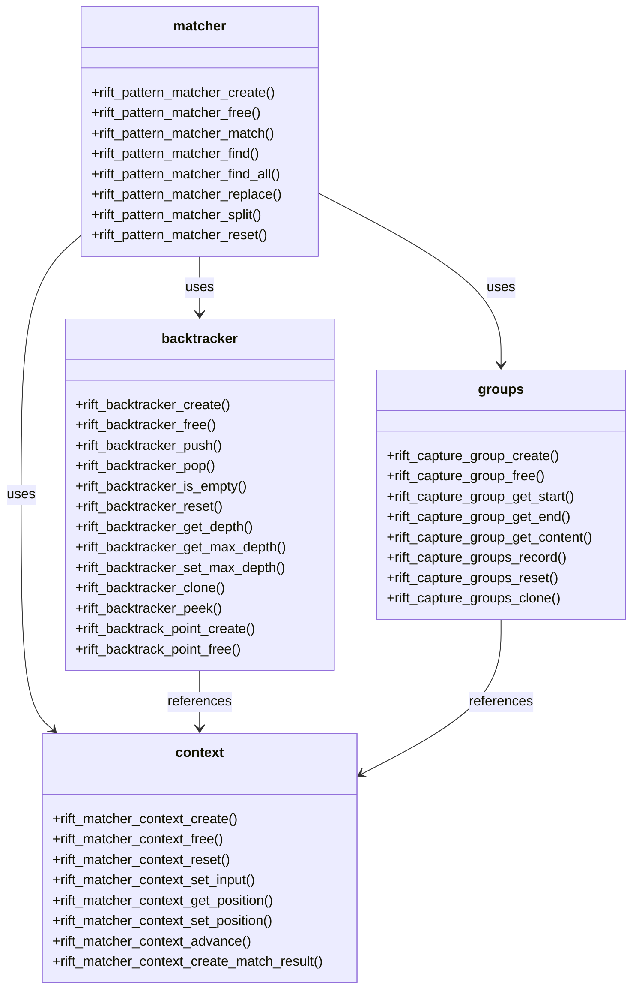

```mermaid
classDiagram
    class backtracker {
        +rift_backtracker_create()
        +rift_backtracker_free()
        +rift_backtracker_push()
        +rift_backtracker_pop()
        +rift_backtracker_is_empty()
        +rift_backtracker_reset()
        +rift_backtracker_get_depth()
        +rift_backtracker_get_max_depth()
        +rift_backtracker_set_max_depth()
        +rift_backtracker_clone()
        +rift_backtracker_peek()
        +rift_backtrack_point_create()
        +rift_backtrack_point_free()
    }
    
    class matcher {
        +rift_pattern_matcher_create()
        +rift_pattern_matcher_free()
        +rift_pattern_matcher_match()
        +rift_pattern_matcher_find()
        +rift_pattern_matcher_find_all()
        +rift_pattern_matcher_replace()
        +rift_pattern_matcher_split()
        +rift_pattern_matcher_reset()
    }
    
    class groups {
        +rift_capture_group_create()
        +rift_capture_group_free()
        +rift_capture_group_get_start()
        +rift_capture_group_get_end()
        +rift_capture_group_get_content()
        +rift_capture_groups_record()
        +rift_capture_groups_reset()
        +rift_capture_groups_clone()
    }
    
    class context {
        +rift_matcher_context_create()
        +rift_matcher_context_free()
        +rift_matcher_context_reset()
        +rift_matcher_context_set_input()
        +rift_matcher_context_get_position()
        +rift_matcher_context_set_position()
        +rift_matcher_context_advance()
        +rift_matcher_context_create_match_result()
    }
    
    matcher --> backtracker : uses
    matcher --> groups : uses
    matcher --> context : uses
    backtracker --> context : references
    groups --> context : references
```